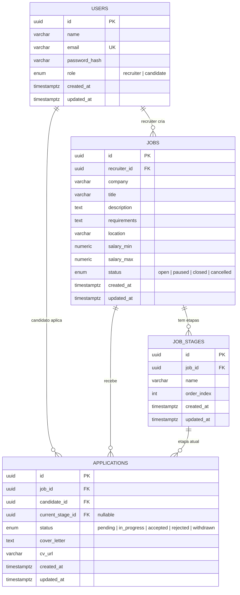
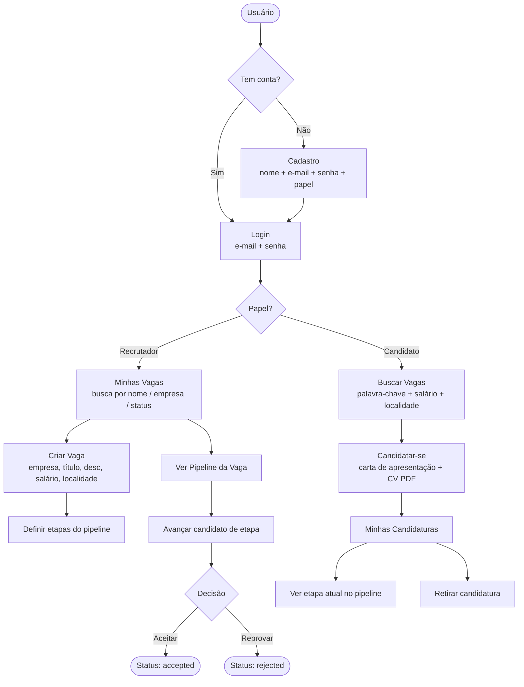

# Sistema de Recrutamento & Seleção

Aplicação web full-stack para gerenciar vagas, candidaturas e pipelines de seleção.

Backend em **Go + Gin + GORM + PostgreSQL** · Frontend em **React + TypeScript + Vite**

---

## Tech Stack

| Camada    | Tecnologia                              |
|-----------|-----------------------------------------|
| Backend   | Go 1.22, Gin, GORM, PostgreSQL 16       |
| Frontend  | React 18, TypeScript, Vite, Axios, shadcn/ui |
| Auth      | JWT (HS256)                             |
| DevOps    | Docker, Docker Compose                  |

---

## Funcionalidades

**Autenticação**
- Cadastro e login com e-mail e senha (papel: recrutador ou candidato)
- Sessão persistente via JWT — atualizar a página não desloga
- Rotas protegidas: usuário logado não acessa `/login` ou `/register`

**Recrutador**
- Criar vagas com título, empresa, descrição, requisitos, localidade e faixa salarial
- Editar faixa salarial inline na listagem de vagas
- Definir etapas personalizadas do pipeline para cada vaga
- Controlar status da vaga: aberta, pausada, encerrada, cancelada
- Buscar as próprias vagas por nome, empresa e/ou status (com debounce)
- Visualizar candidatos em cada etapa do pipeline com barra de progresso colorida
- Avançar candidato de etapa em etapa até aprovação
- Aceitar ou reprovar candidato a qualquer momento do processo
- Acessar o CV (PDF) e a carta de apresentação de cada candidato
- Confirmação explícita antes de qualquer ação crítica (dialogs)

**Candidato**
- Buscar vagas por palavra-chave, salário e localidade
- Ver badge "Candidatou-se DD/MM/YYYY às hh:mm" nas vagas já aplicadas
- Ocultar/exibir vagas já candidatadas na listagem
- Candidatar-se com carta de apresentação + CV obrigatório (PDF)
- Acompanhar candidaturas com barra do pipeline destacando etapa atual
- Expandir cada candidatura para ver carta de apresentação e link do CV
- Retirar candidatura (ação visível ao recrutador como "withdrawn")

---

## Estrutura do Projeto

```
recruitment-selection/
├── backend/
│   ├── cmd/
│   │   ├── server/          # Entry point da aplicação
│   │   └── seed/            # Script de dados de exemplo (idempotente)
│   ├── internal/
│   │   ├── api/
│   │   │   ├── handler/     # Handlers HTTP (Gin)
│   │   │   └── router.go    # Registro de todas as rotas
│   │   ├── apierror/        # Erros de domínio tipados
│   │   ├── config/          # Carregamento de variáveis de ambiente
│   │   ├── dto/             # Request / Response structs (camada de transporte)
│   │   ├── middleware/       # Auth JWT e CORS
│   │   ├── mock/            # Mocks testify para repository e service
│   │   ├── model/           # Modelos GORM
│   │   ├── repository/      # Camada de acesso ao banco
│   │   ├── service/         # Regras de negócio
│   │   ├── testutil/        # Helpers para testes de integração
│   │   └── token/           # Geração e validação de JWT
│   ├── migrations/          # Migrations SQL puras (executadas na inicialização do DB)
│   ├── uploads/             # Armazenamento de CVs enviados
│   ├── .env.example
│   ├── Dockerfile
│   └── go.mod
├── frontend/
│   ├── src/
│   │   ├── components/      # Componentes reutilizáveis (Navbar, PipelineBar, StatusBadge…)
│   │   ├── contexts/        # AuthContext (estado global de autenticação)
│   │   ├── hooks/           # useAuth
│   │   ├── pages/
│   │   │   ├── auth/        # LoginPage, RegisterPage
│   │   │   ├── candidate/   # BrowseJobsPage, MyApplicationsPage
│   │   │   └── recruiter/   # MyJobsPage, CreateJobPage, JobPipelinePage
│   │   ├── services/        # Chamadas Axios (api, auth, jobs, applications)
│   │   └── types/           # Interfaces TypeScript
│   └── package.json
├── docs/
│   └── api.md               # Referência completa da API REST
├── docker-compose.yml
└── README.md
```

---

## Schema do Banco de Dados



---

## Fluxo da Aplicação



---

## Como Executar

### Pré-requisitos

- Docker e Docker Compose

### Subir tudo

```bash
# Copiar variáveis de ambiente
cp backend/.env.example backend/.env

# Subir banco + backend
docker compose up -d

# Backend disponível em http://localhost:8080
# Frontend disponível em http://localhost:5173
```

### Backend local (sem Docker)

```bash
cd backend
cp .env.example .env
# Ajuste .env com suas credenciais do PostgreSQL local

go mod tidy
go run ./cmd/server
```

### Frontend local

```bash
cd frontend
npm install
npm run dev
```

### Popular o banco com dados de exemplo

O script de seed cria 1 recrutador, 10 candidatos, 8 vagas em empresas e status variados e 23 candidaturas espalhadas por diversas etapas do pipeline. É idempotente — pode ser rodado mais de uma vez sem duplicar dados.

```bash
cd backend
go run ./cmd/seed/main.go
```

Credenciais criadas pelo seed:

| Papel       | E-mail                        | Senha    |
|-------------|-------------------------------|----------|
| Recrutador  | recrutador@techbr.com         | senha123 |
| Candidato 1 | joao.silva@email.com          | senha123 |
| Candidato 2 | maria.santos@email.com        | senha123 |
| …           | (até beatriz.rocha@email.com) | senha123 |

### Testes

```bash
cd backend

# Testes unitários
go test ./internal/...

# Testes de integração (requer container db_test)
docker compose up -d db_test
go test ./internal/... -tags=integration -v
```

---

## API

| Método | Endpoint                                 | Auth       | Descrição                              |
|--------|------------------------------------------|------------|----------------------------------------|
| POST   | /api/v1/auth/register                    | Público    | Cadastrar novo usuário                 |
| POST   | /api/v1/auth/login                       | Público    | Login, retorna JWT                     |
| GET    | /api/v1/jobs                             | Público    | Listar vagas abertas (com filtros)     |
| GET    | /api/v1/jobs/:id                         | Público    | Detalhes da vaga + etapas              |
| GET    | /api/v1/recruiter/jobs?q=&status=        | Recrutador | Minhas vagas (busca por nome/empresa/status) |
| POST   | /api/v1/recruiter/jobs                   | Recrutador | Criar vaga                             |
| PUT    | /api/v1/recruiter/jobs/:id               | Recrutador | Atualizar vaga                         |
| DELETE | /api/v1/recruiter/jobs/:id               | Recrutador | Deletar vaga                           |
| PUT    | /api/v1/recruiter/jobs/:id/stages        | Recrutador | Redefinir etapas do pipeline           |
| GET    | /api/v1/recruiter/jobs/:id/applications  | Recrutador | Candidaturas de uma vaga               |
| PATCH  | /api/v1/recruiter/applications/:id/stage  | Recrutador | Avançar candidato à próxima etapa      |
| PATCH  | /api/v1/recruiter/applications/:id/status | Recrutador | Aceitar ou reprovar candidato          |
| POST   | /api/v1/jobs/:id/apply                   | Candidato  | Candidatar-se (multipart: carta + CV)  |
| GET    | /api/v1/applications                     | Candidato  | Minhas candidaturas                    |
| PATCH  | /api/v1/applications/:id/withdraw        | Candidato  | Retirar candidatura                    |
| GET    | /api/v1/health                           | Público    | Health check                           |

Documentação completa: [docs/api.md](docs/api.md)
