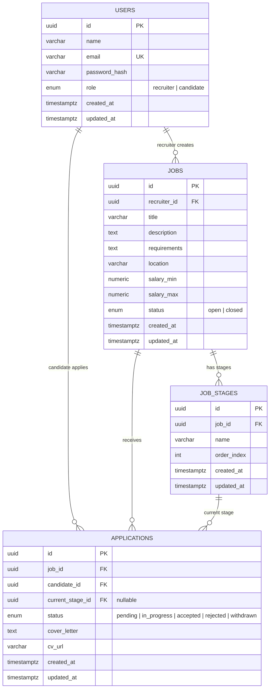
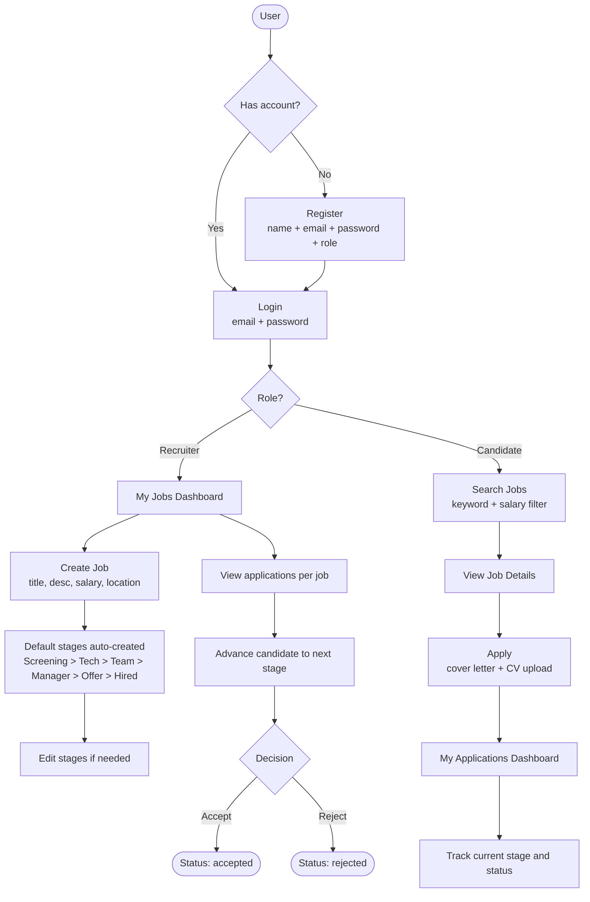

# Recruitment & Selection System

A full-stack web application for managing job postings, candidate applications, and selection pipelines.

Built with **Go + Gin + GORM + PostgreSQL** on the backend and **React + TypeScript + Vite** on the frontend.

---

## Tech Stack

| Layer    | Technology                          |
|----------|-------------------------------------|
| Backend  | Go 1.22, Gin, GORM, PostgreSQL 16   |
| Frontend | React 18, TypeScript, Vite, Axios   |
| Auth     | JWT (HS256)                         |
| DevOps   | Docker, Docker Compose              |

---

## Features

- User registration and login (recruiter or candidate)
- JWT-based authentication with persistent sessions
- Recruiters: create and manage job postings with custom selection pipelines
- Candidates: search jobs (with salary filter), apply with cover letter and CV upload
- Recruiters: advance candidates through pipeline stages
- Protected routes: cannot access login/register when already authenticated

---

## Project Structure

```
recruitment-selection/
├── backend/
│   ├── cmd/server/          # Entry point
│   ├── internal/
│   │   ├── api/handler/     # HTTP handlers (Gin)
│   │   ├── config/          # Environment config loader
│   │   ├── middleware/      # Auth, CORS middleware
│   │   ├── model/           # GORM models
│   │   ├── repository/      # Database access layer
│   │   └── service/         # Business logic layer
│   ├── migrations/          # Plain SQL migrations (run on DB init)
│   ├── uploads/             # CV file storage
│   ├── .env.example
│   ├── Dockerfile
│   └── go.mod
├── frontend/
│   ├── src/
│   │   ├── components/      # Reusable UI components
│   │   ├── hooks/           # Custom React hooks
│   │   ├── pages/           # Route-level pages
│   │   ├── services/        # Axios API calls
│   │   └── types/           # TypeScript interfaces
│   └── package.json
├── docs/
│   └── api.md               # REST API reference
├── docker-compose.yml
└── README.md
```

---

## Database Schema



---

## Application Flow



---

## Getting Started

### Prerequisites

- Docker and Docker Compose

### Run everything

```bash
# Copy environment variables
cp backend/.env.example backend/.env

# Start DB + backend + test DB
docker compose up -d

# Backend is available at http://localhost:8080
```

### Run backend locally (without Docker)

```bash
cd backend
cp .env.example .env
# Edit .env with your local PostgreSQL credentials

go mod tidy
go run ./cmd/server
```

### Run tests

```bash
cd backend

# Unit tests
go test ./internal/...

# Integration tests (requires db_test container running)
docker compose up -d db_test
go test ./internal/... -tags=integration -v
```

---

## API Overview

| Method | Endpoint                              | Auth     | Description                    |
|--------|---------------------------------------|----------|--------------------------------|
| POST   | /api/v1/auth/register                 | No       | Register new user              |
| POST   | /api/v1/auth/login                    | No       | Login, returns JWT             |
| GET    | /api/v1/jobs                          | No       | List open jobs (with filters)  |
| GET    | /api/v1/jobs/:id                      | No       | Job details + stages           |
| POST   | /api/v1/jobs                          | Recruiter| Create job                     |
| PUT    | /api/v1/jobs/:id                      | Recruiter| Update job                     |
| DELETE | /api/v1/jobs/:id                      | Recruiter| Delete job                     |
| GET    | /api/v1/jobs/:id/stages               | Auth     | List stages for a job          |
| PUT    | /api/v1/jobs/:id/stages               | Recruiter| Update stages for a job        |
| POST   | /api/v1/jobs/:id/apply                | Candidate| Apply to a job (with CV)       |
| GET    | /api/v1/applications                  | Candidate| My applications                |
| GET    | /api/v1/recruiter/applications        | Recruiter| All applications for my jobs   |
| PATCH  | /api/v1/applications/:id/stage        | Recruiter| Advance candidate to next stage|
| PATCH  | /api/v1/applications/:id/status       | Recruiter| Accept or reject candidate     |
| GET    | /api/v1/health                        | No       | Health check                   |

Full API documentation: [docs/api.md](docs/api.md)
